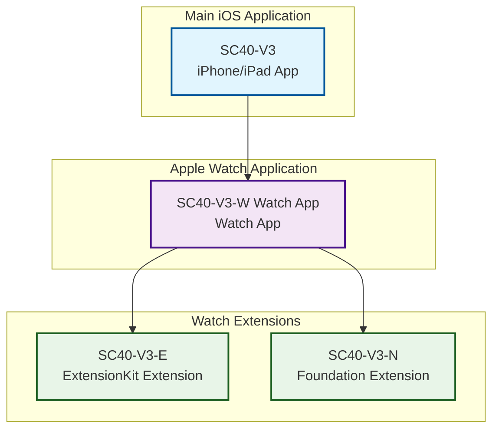

# Project Schemes Diagram for Sprint Coach 40

## SC40-V3 Xcode Project Structure



## Scheme Configuration

### Available Schemes:
1. **SC40-V3** - Main iOS app scheme (Debug/Release)
2. **SC40-V3-W Watch App** - Watch app scheme (Debug/Release)
3. **SC40-V3-E** - ExtensionKit extension scheme (Debug/Release)
4. **SC40-V3-N** - Foundation extension scheme (Debug/Release)

### Typical Scheme Usage:
- **Development**: Use individual schemes for targeted development
- **Testing**: Test iOS + Watch connectivity using main app scheme
- **Distribution**: Build all components together for App Store

## Build Dependencies:
- iOS app embeds Watch app during build process
- Watch app includes both extensions in its bundle
- Extensions run within Watch app's process space

## Platform Targets:
- **iOS**: iPhone and iPad (TARGETED_DEVICE_FAMILY = 1,2)
- **watchOS**: Apple Watch only (TARGETED_DEVICE_FAMILY = 4)
- **Deployment**: iOS 17.0+, watchOS 10.0+
```

## Scheme Relationships in Detail

The project follows a typical iOS + watchOS app structure where:

1. **Main iOS App** (`SC40-V3`) is the primary application that users download
2. **Watch App** (`SC40-V3-W Watch App`) is embedded within the iOS app bundle
3. **Extensions** (`SC40-V3-E` and `SC40-V3-N`) provide additional functionality to the Watch app

### Build Process:
```
iOS App Build → Embeds Watch App → Watch App Includes Extensions
     ↓              ↓                    ↓
   Runs on        Runs on             Provide
 iPhone/iPad    Apple Watch        Enhanced Features
```

### Development Workflow:
- Edit iOS code → Build iOS scheme → Test on device
- Edit Watch code → Build Watch scheme → Test on paired watch
- Test connectivity → Build main app scheme → Deploy to both devices

This structure allows for independent development of each component while maintaining the integrated iOS + watchOS experience that users expect.
